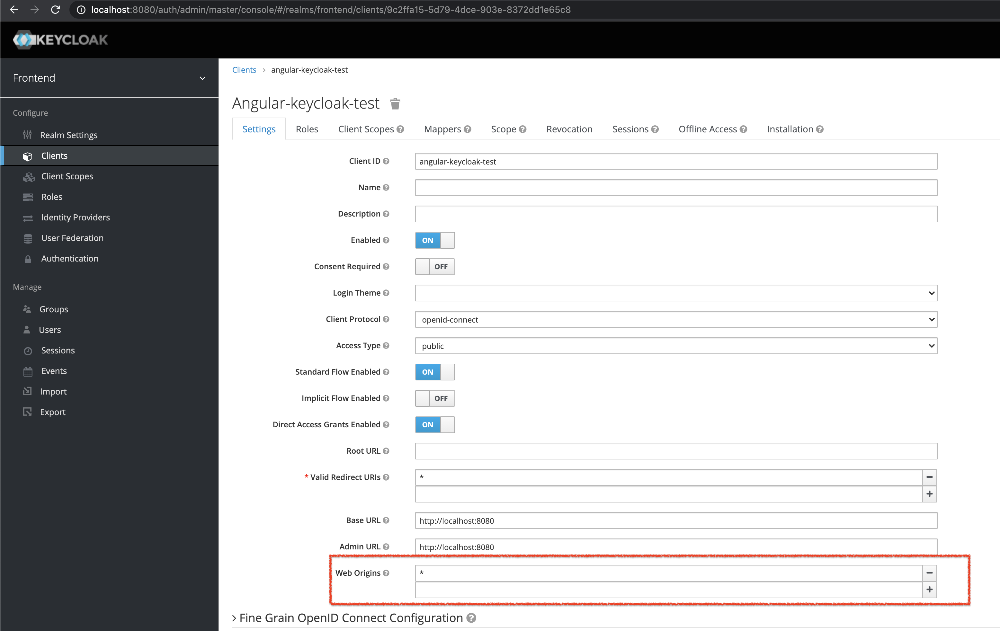

# Angular Server Side Rendering With Keycloak

You can create user and login with keycloak to angular application.

```
Keycloak Admin User and Password: admin
```

### Keycloak Installation

```
$ docker-compose up -d
```

Keycloak Server listening on http://localhost:8080

### Angular Installation

```
$ yarn install
```

### Angular Run Dev Mode

```
$ yarn start
```

### Angular Run Prod Mode

```
$ yarn build:ssr
$ yarn serve:ssr
```

Server listening on http://localhost:4000

NOT: Please add "\*" to WebOrigins for "Angular-keycloak-test" client.


